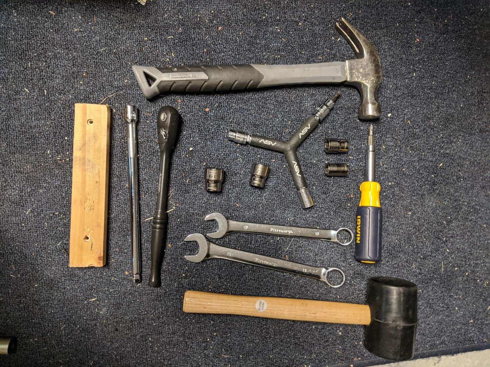
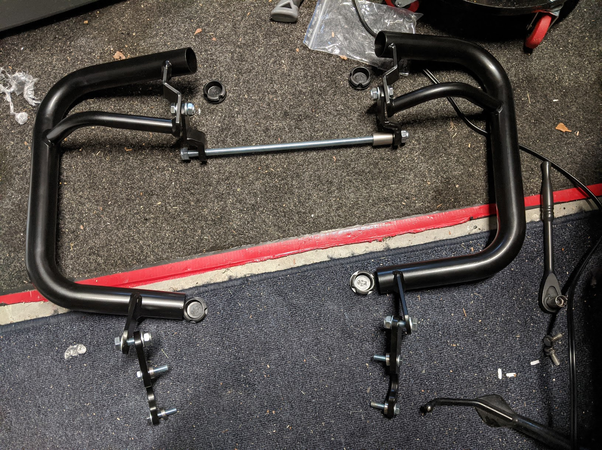
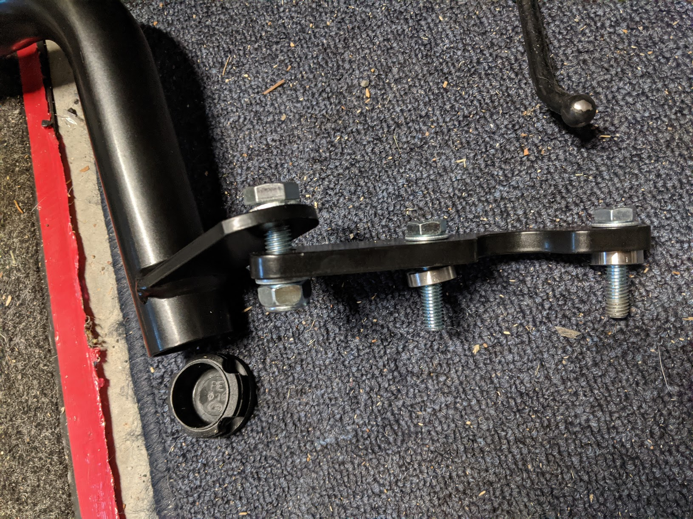
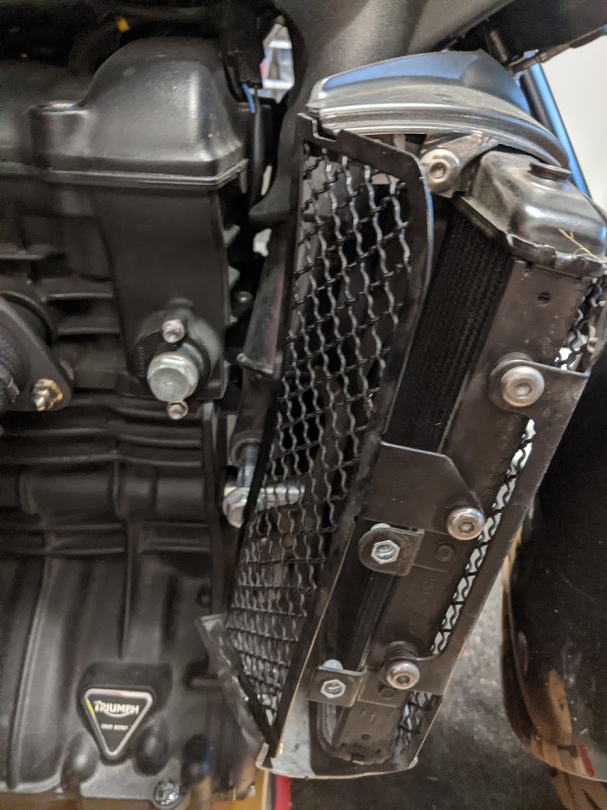
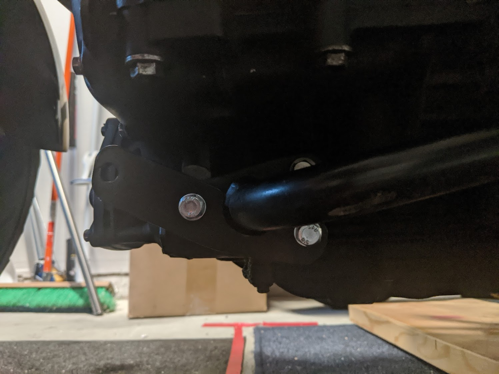
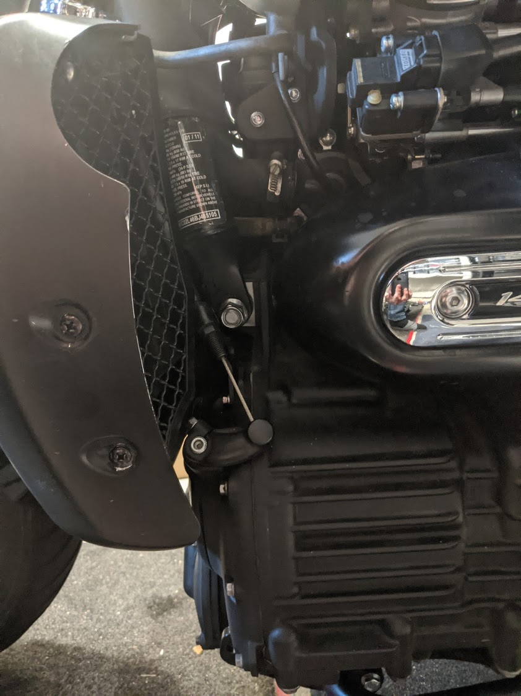
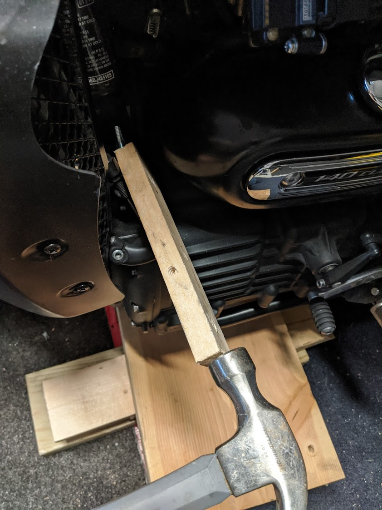
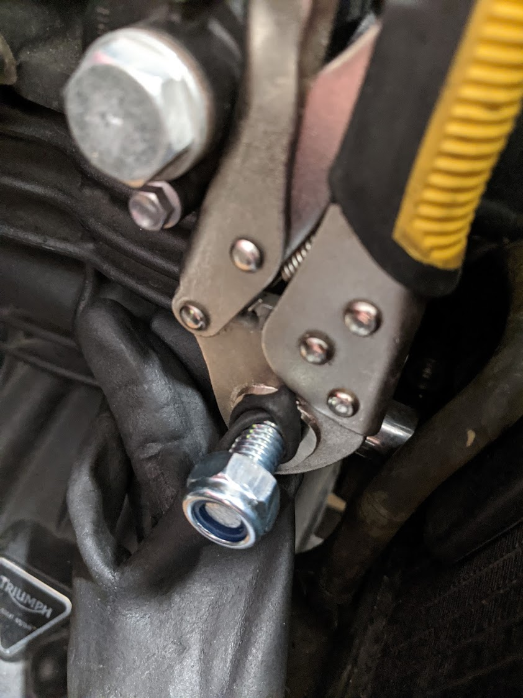
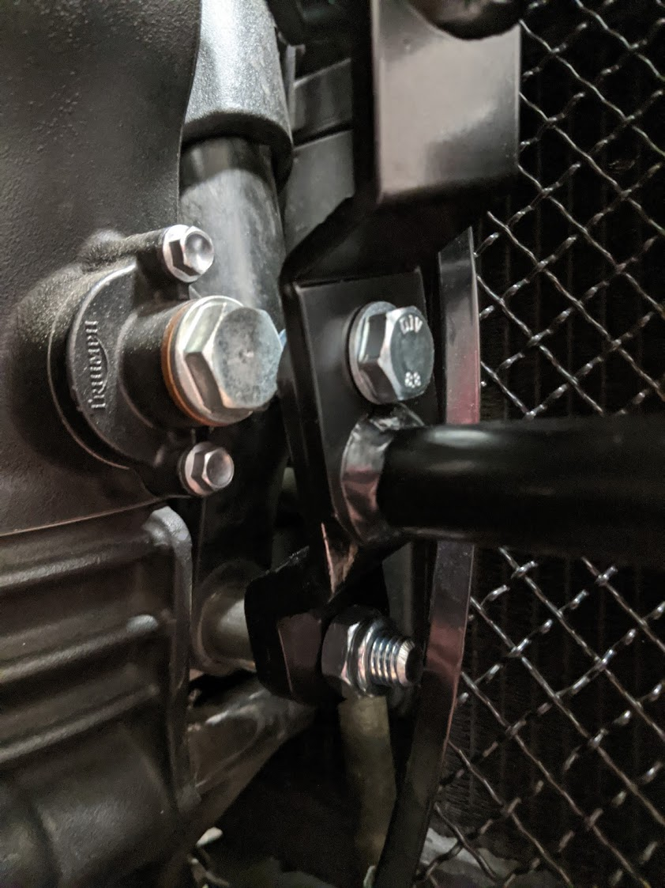

## Brief
Simple instructions for mouting this engine guard to my '11 Rocket 3 Roadster

## Inventory
After ensuring you have all parts, do a test-fit with all pieces. You can pop on the endcaps anytime.

## Tools
- bike jack / wood blocks (take weight off the engine bolt)
- Hammer (tap the center bolt) + wood scraps
- ratchet + wobble extension
- wrenchs (17mm, 19mm)
- short sockets (12mm, 14mm, 17mm, 19mm)
- Phillips screw driver
- rubber mallot (optional but nice to have)
- 5mm allen
- vice grips (optional)
- Rubber gloves (optional)

## Key
Left side - Intake Side
Right Side - Exhaust Side

## all pieces assembled (loosely)

## close-up of the lower bracket, including the 2 spacers

## Mounting
Remove the right radiador guard mesh (blocks the bolt) Remove the 4 screws and the shroud, then remove the top screw and the side allen to remove the mesh.

Remove the 2 bottom bolts with a 12mm socket, replace with the mounting bracket as shown, be sure to use the short spacers.

Jack-up the motorcycle engine enough to releve the pressure on the axle bolt, it should come out smoothly, follow it with the threaded rod, lightly tap it with a hammer+wood scrap or a mallot.

Make sure the left side (intake side) has more threads showing than the right as clearance is an issue, no less than 3 threads showing on either side, if you need help preventing the bolt from moving, you can use vise-grips and something (I used a rubber glove) to protect the threads.  The right-side will get the long spacer.

## Tightening things up
Now that everything is mounted, go back and tighten everything up, do not overtighten! 12-14 ft-lb of torque should be plenty, check them the first few rides to ensure they don't back themselves out with vibration, althought they are nylon locnuts you could use some loctite.

## Followup
questions/comments/concerns, [open an issue](https://github.com/JakeDEvans/motea-craftride-installation/issues/new) and I can ellaborate.
